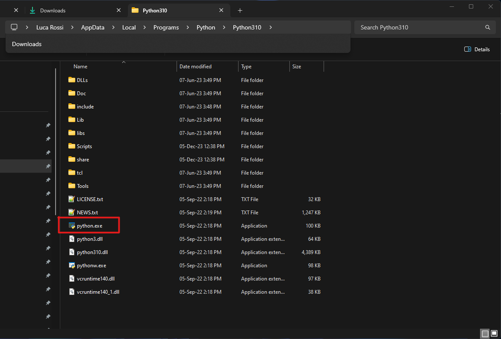

# Python wrapper

## Requirements
For the example to work, you need to install the USB driver provided by FTDI. This can be done by either installing EDR4, or by installing the driver directly from https://ftdichip.com/drivers/d2xx-drivers/, version 2.12.36.4 x64 for Windows.

In either case, the procedure correctly ends only once the current amplifier is plugged to to the PC via a USB cable.

## Installation
Currently the Python wrapper of the e4 only works on Windows systems.

### Windows
Install Python 3.10.7, you can use the installer in this folder.

The Python version 3.10.7 is currently required in order to allow the usage of the *.dll files used to control our devices.

Once installed locate the python interpreter, should be under the following path ```C:\Users\<User>\AppData\Local\Programs\Python310```

Open a **command prompt**.

Navigate to the folder you wish to install the calibrator to.

Now you need to use Python to create a **virtual environment** also called **venv**.

Be sure to use the right version of Python to create the virtual environment, for this reason go to the previously located path and copy the absolute path of the **python.exe** file like in the following image.



```
"abs/path/of/python.exe" -m venv .\
```
After the creation of the venv activate it by typing: ```Scripts\activate```

Now that the venv is active you need to install all the dependency from the requirements.txt using ```pip install -r path\to\requirements.txt``` then copy all the files from the **dlls** folder into the **Lib\site-packages** folder that has been created with the venv.

## Usage
The typical sequence of commands is:
- detectDevices
- connect
- configure: you can configure it in various way (sampling rate, current range ecc.)
- read data/run your experiment
- disconnect

To work with the er4-python open the command prompt.

Activate the virtual environment with: ```Scripts\activate```

Run the script : ```python .\your_script.py```

You can find an example with some callable functions in this directory.
